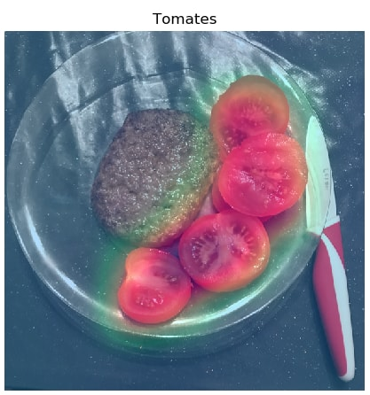

# Home assignment - Tomato allergies

Open domain image classification

## Context

In the context of meal logging, there is a fluctuating asymmetry between task evaluation (user expectation) and data qualification for training (result of labeling), that require specific care. Additionally, in order to have proper class separation, training sometimes requires a superior granularity compared to evaluation's. 

The research team of Foodvisor is in charge of creating the detection algorithm used for meal logging with the mobile app. Opening access to the app in a new region of the world usually brings about new user expectations.

## Assignment # 1

In this assignment, you will create a Deep Learning model to detect whether a meal includes specifics ingredients some users are allergic to. For the sake of simplicity, we will consider a growing amount of user are allergic to tomatoes produced in their countries. We'll try to throw a warning if traces of tomatoes are present in the picture.

You are provided with a training and test sets that are labeled with bounding boxes, and way more items than you need to identify. Feel free to discard the extra information or use it if it can help you.

### Submission

Your implementation is expected to be a GitHub (or similar) repository, implemented in Python3. If you are to use a Deep Learning frameworks, feel free to use either PyTorch or Tensorflow. If you plan on using another deep learning framework, or old versions of the mentioned frameworks, please reach out to your interviewer as early as possible.

Your repository should include:

- instructions to install requirements to run your code
- clear instructions to train your model on the provided database
- plots of training and test accuracy
- your trained model checkpoint in a [release](https://help.github.com/en/github/administering-a-repository/creating-releases)
- credits to the different repositories or resources that you used for your implementation

It should NOT include:

- the dataset (just allow the user to provide the path to the extracted dataset and annotations)

### Evaluation

- $error\_rate = \frac{\#\ classification\ errors}{\#\ images} \leq 0.05 $

Not meeting this success condition does not necessarily mean that your application won't be considered further, but we expect you to produce code of your own. <u>Plagiarism will not be considered lightly.</u>

### Resources

We encourage you to use freely available resources such as Google Colab (GPUs available to non-paying users have been updated to Tesla P100 in november 2019) if you don't have any available GPU (or prefer not using it).

If you are new to Colab, here is a short [tutorial](https://drive.google.com/open?id=1efNEDlhJaQrF6VH2AWa6rnCYmcSAeX_O) we made for you.

*Please note that many of those topics won't have a specific answer or any given answer and will only be mentioned to better understand your approach*

## Assignment # 2

In this assignment, you will implement a class activation extraction module to leverage the results of Assignment #1. The goal here is not to train another model for this task or to chase high localization performances, but to generate a class activation map using this [paper](https://arxiv.org/pdf/1512.04150.pdf) similar to the one below:

To evaluate your proposition, you are encouraged to use the bounding boxes of the dataset to check if it does work.

### Submission

Your implementation is expected to be a GitHub (or similar) repository, implemented in Python3. If you are to use a Deep Learning frameworks, feel free to use either PyTorch or Tensorflow. If you plan on using another deep learning framework, or old versions of the mentioned frameworks, please reach out to your interviewer as early as possible.

Your repository should include:

- instructions to install requirements to run your code
- clear instructions to run and evaluation of your localization module on the test set
- credits to the different repositories or resources that you used for your implementation

It should NOT include:

- the dataset (just allow the user to provide the path to the extracted dataset and annotations)

### Evaluation

As mentioned, this is an exploratory assignment and there is no success condition. The only constraint is that you have to use the exact same network that you trained for Assignment #1.

Again, we expect you to produce code of your own. <u>Plagiarism will not be considered lightly.</u>

### Resources

cf. Assignment #1

### Data

Please check this [release](https://github.com/Foodvisor/home-assignment/releases/tag/v0.1.0) attachments for the data you can use to test your code:

- label_mapping.csv: the names of each class (available both in English and French)
- img_annotations.json: the image annotations _(bounding box in format [upper_left_x, upper_left, y, height, width], the associated class id, and whether this class is considered as background)_
- image folder: the archived image folder that your interviewer sent you

Best of luck!
